# Reports — Figure Gallery

All charts are generated automatically by the project notebooks and saved to `figures/`.
Re-run each notebook to regenerate its figures.

| Notebook | Figures | Source |
|----------|---------|--------|
| `02_eda.ipynb` | 01–18 | EDA — temporal, price, brand, city, engagement, correlations |
| `03_supply_demand.ipynb` | 19–27 | Supply & demand analysis by city and price |

---

## Temporal Evolution

> Listing activity and price trends across the 12 scrape dates (Aug 2022 – May 2024).

### 01 — Listing volume per scrape date

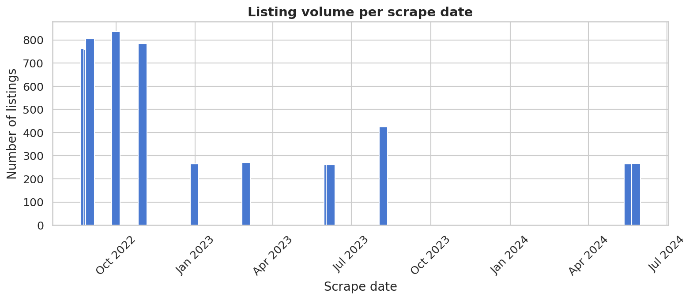

Supply peaks at ~800 listings/scrape in late 2022 then drops to ~260–430 from early 2023 onwards. A significant gap with no scraping is visible between Oct 2023 and May 2024. This irregular cadence must be accounted for in any temporal analysis: comparing raw listing counts across dates without normalising for elapsed time can be misleading.

---

### 02 — Price evolution over time (sell listings)

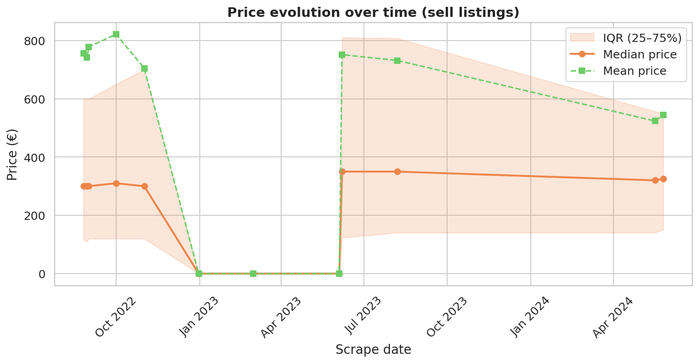

The **median price** (orange) is remarkably stable at ~300–350 € across the full period. The **mean** (~520–820 €) is systematically inflated by a thin premium segment (organs, professional synths), confirming the distribution is right-skewed. The **IQR band** narrows slightly over time, suggesting the mid-range market became more homogeneous in 2023–2024. Three sessions (2022-12-31, 2023-03-01, 2023-06-04) show price = 0 — a **data quality artefact** caused by missing price fields in those scrape files, not a real market event.

---

### 03 — Listing type share over time

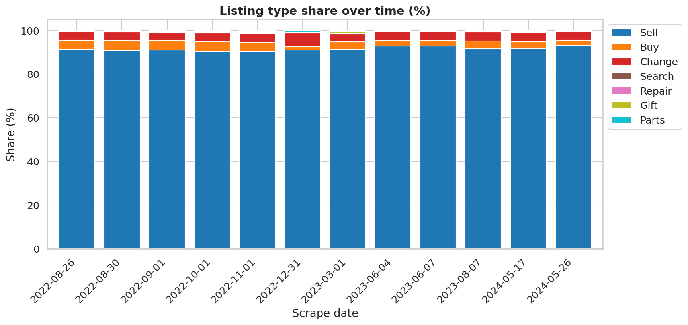

**Sell** listings dominate at ~90–95% in every single session. **Change** (trade) and **Buy** (wanted ads) each contribute a small but consistent share (~2–5% combined). Niche types — Search, Repair, Gift, Parts — remain below 2% throughout. The proportions are strikingly stable across all dates and years: the marketplace structure did not change fundamentally between 2022 and 2024.

---

## Price Analysis

> Distribution, outliers and spread of sell listing prices.

### 04 — Price distribution (sell listings, ≤p99)

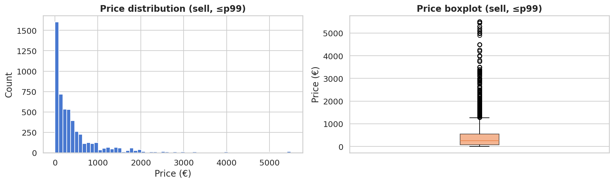

The distribution is strongly **right-skewed**. The histogram peaks in the 0–200 € bin (~1,600 listings) and drops rapidly as price rises. The boxplot confirms the skew: IQR spans ~€75–550, median ~€250. The dots above the whisker represent legitimate high-end outliers (vintage synthesisers, organs, professional equipment) reaching €2,000–5,500. The 47 listings above p99 (>€5,500) are excluded from this view to preserve scale.

---

## Brand Analysis

> Volume, price positioning and temporal activity by brand.

### 05 — Top 15 brands by listing count

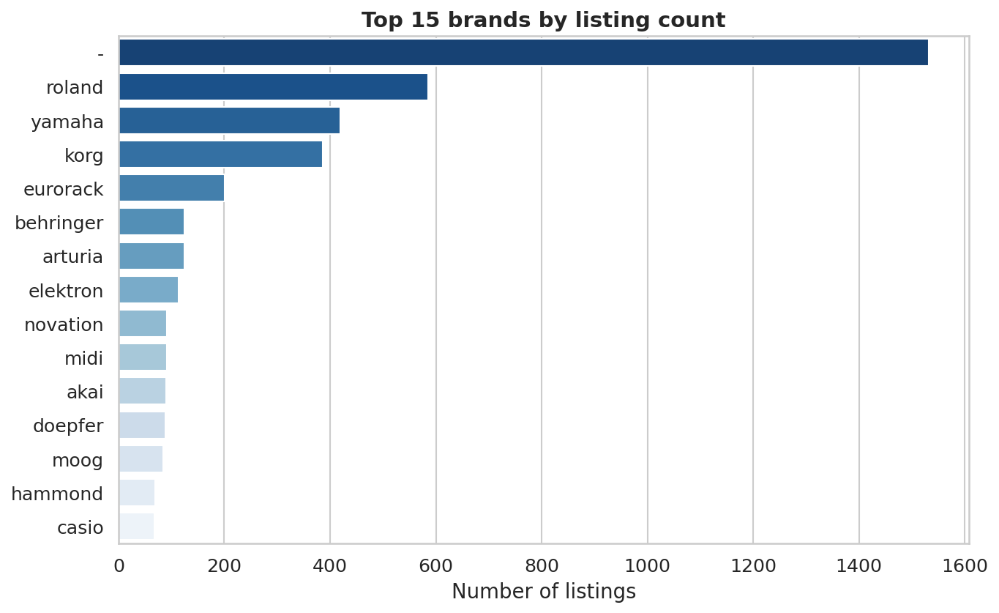

**"-"** leads with ~1,530 listings — listings where no brand could be extracted from free text. This is a brand-detection limitation, not a real brand. Among identifiable brands, **Roland** (~580), **Yamaha** (~420) and **Korg** (~390) are the top three. **Eurorack** (~200) represents a *format*, not a manufacturer — it captures modular listings without a specific maker, reflecting a thriving modular community on the platform. The remaining brands (Behringer, Arturia, Elektron, Novation…) form a long tail of specialist gear.

---

### 06 — Median sell price — top 15 brands

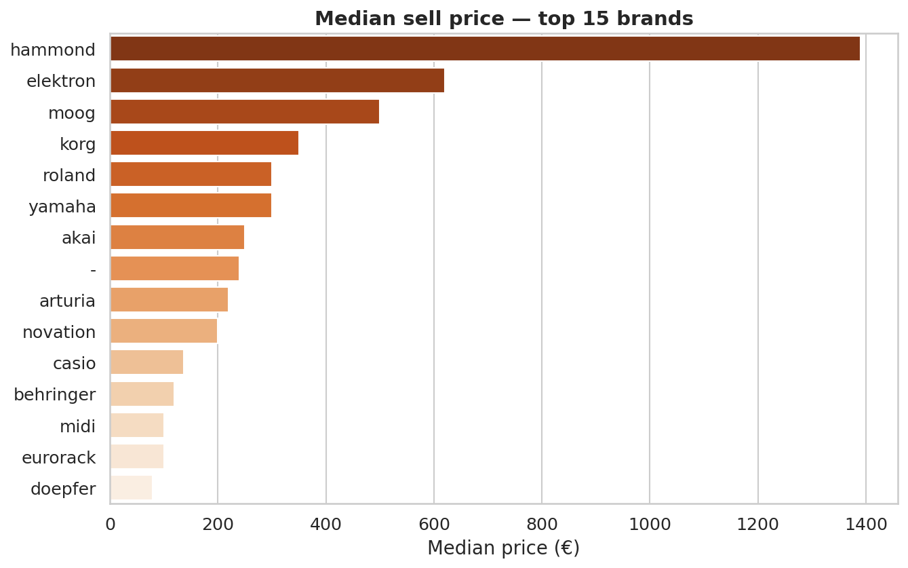

**Hammond** (~€1,400) leads by a large margin, reflecting the iconic status and scarcity of vintage organs. **Elektron** (~€620) and **Moog** (~€500) follow as premium boutique brands with strong resale value. The high-volume brands (**Korg** ~€350, **Roland** ~€310, **Yamaha** ~€300) sit in the mid-range, their broad catalogues spanning both affordable and professional tiers. **Behringer** (~€110), **Eurorack** (~€85) and **Doepfer** (~€65) sit at the low end, consistent with affordable clones and individual modular modules. The "-" (unbranded) category sits around €240 — in line with the overall market median.

---

### 07 — Top 8 brands — listing volume over time

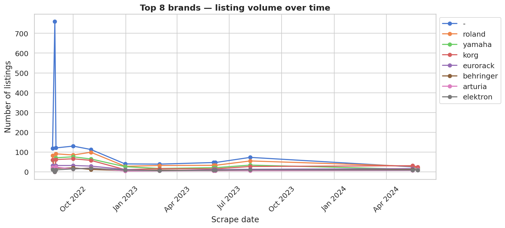

**Roland** and **Korg** maintain the most stable and consistent volumes across all sessions, reflecting their broad and loyal user base. All brands show the same structural drop from late 2022 to 2023, consistent with reduced scraping frequency rather than a genuine market contraction. Smaller brands (Arturia, Novation, Elektron) show low but persistent activity, confirming a niche but steady audience.

---

### 08 — Brand × scrape date — listing count heatmap

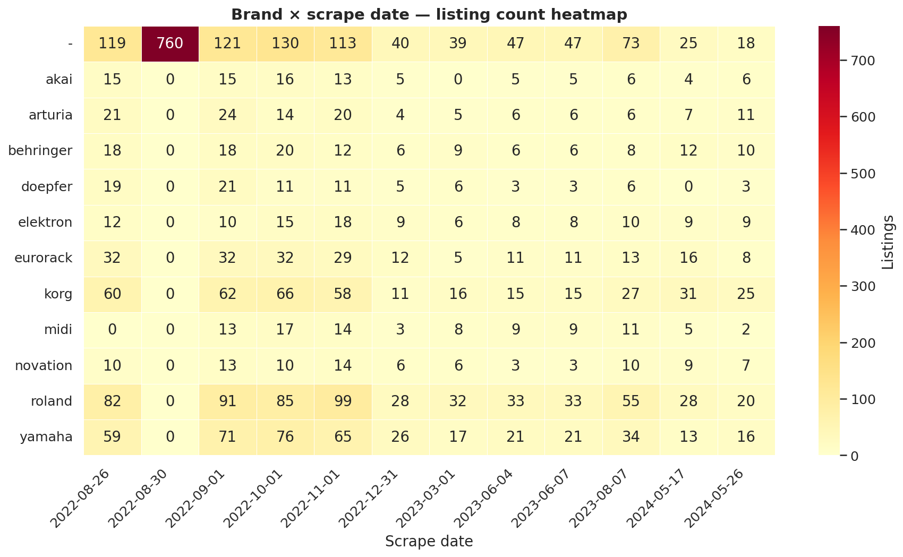

The **2022-08-30 session reveals a critical data quality issue**: all named brands show 0 while "-" spikes to 760. This is a confirmed brand-extraction failure — all listings on that date were dumped into the unidentified bucket. This session must be excluded from any brand-level analysis. For all other sessions, **Roland** is the most consistently present brand (82–99 listings in the 2022 peak, 20–55 afterwards). The volume drop from late 2022 onward is visible uniformly across all brands.

---

## Geographic Analysis

> Listing volume and price distribution across Spanish cities.

### 09 — Top 15 cities by listing count

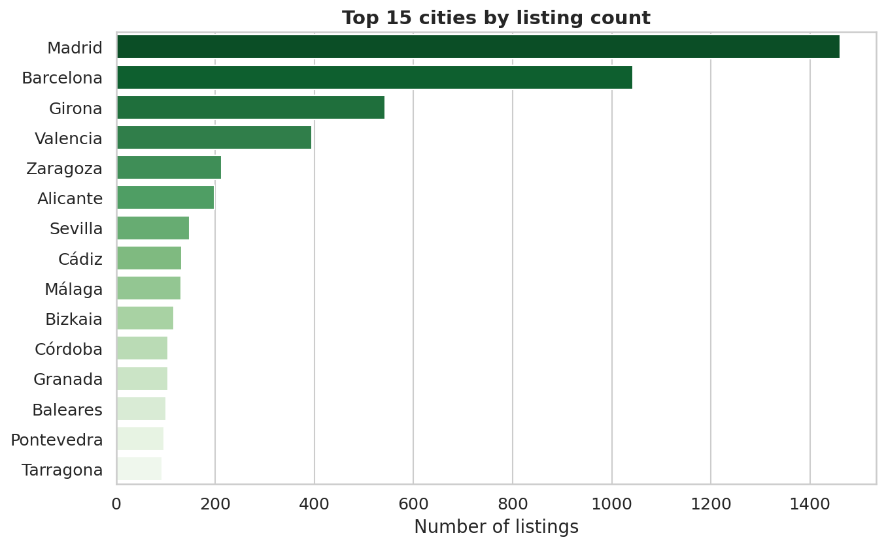

**Madrid** (~1,450) and **Barcelona** (~1,040) together account for ~42% of all listings, reflecting Spain's demographic concentration. **Girona** is a disproportionate third (~535), which may reflect province-level geographic tagging capturing a wider area rather than genuine city-level activity. The remaining cities each contribute under 400 listings, forming a long tail of smaller regional markets. Read alongside Fig 10, this volume ranking is notably **inverse** to the price ranking.

---

### 10 — Median sell price — top 15 cities

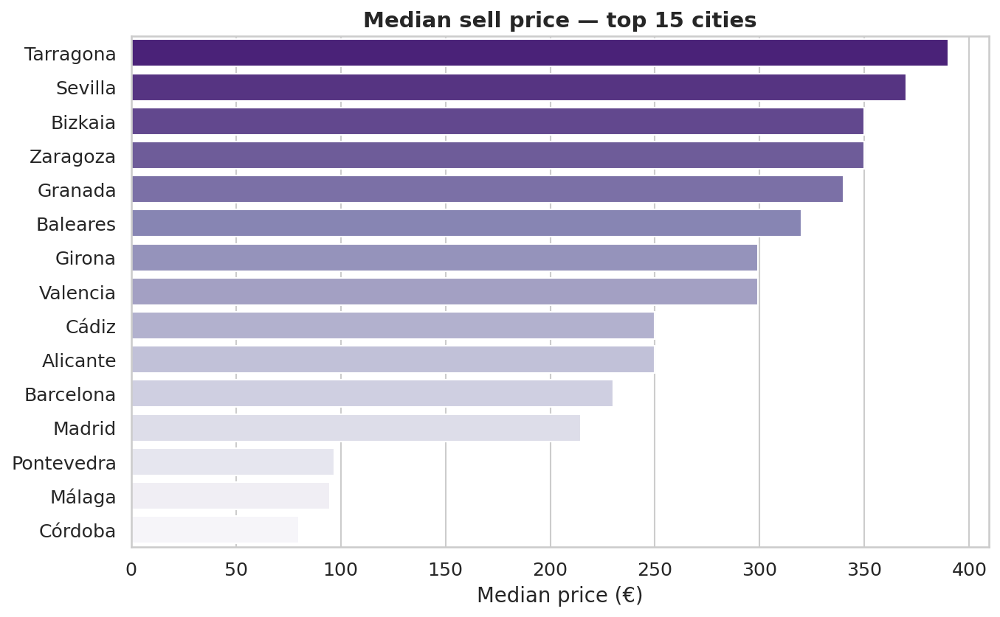

A **counterintuitive inverse relationship** exists between listing volume and median price: the highest-volume cities (Madrid ~€215, Barcelona ~€230) show the *lowest* median prices, while low-volume cities (Tarragona ~€390, Sevilla ~€370, Bizkaia ~€350) show the *highest*. Greater competition in large markets compresses prices; smaller markets see more selective, higher-value listings. Girona is an exception — high volume yet a relatively high median (~€300), possibly reflecting a concentration of premium-brand sellers in the area.

---

### 11 — Top 6 cities — listing volume over time

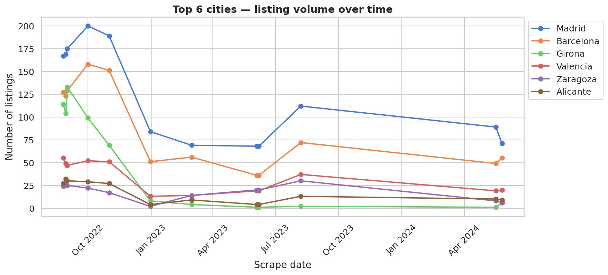

**Madrid** (blue) dominates consistently: peak ~200 listings in Oct 2022, dropping to ~65–85 in early 2023, partial recovery to ~110 in mid-2023, stabilising at ~85–100 by 2024. **Barcelona** mirrors this pattern at roughly half the volume. **Girona** (green) is the notable outlier: from ~130 listings in the 2022 peak it collapses to near zero by Jan 2023 and never recovers — disproportionate compared to other cities and likely a data capture issue rather than a genuine market exit. Valencia, Zaragoza and Alicante maintain low, relatively flat volumes throughout.

---

## Engagement

> Analysis of the `seen` (views) variable as a passive demand proxy.

### 12 — "Seen" distribution (≤p99)

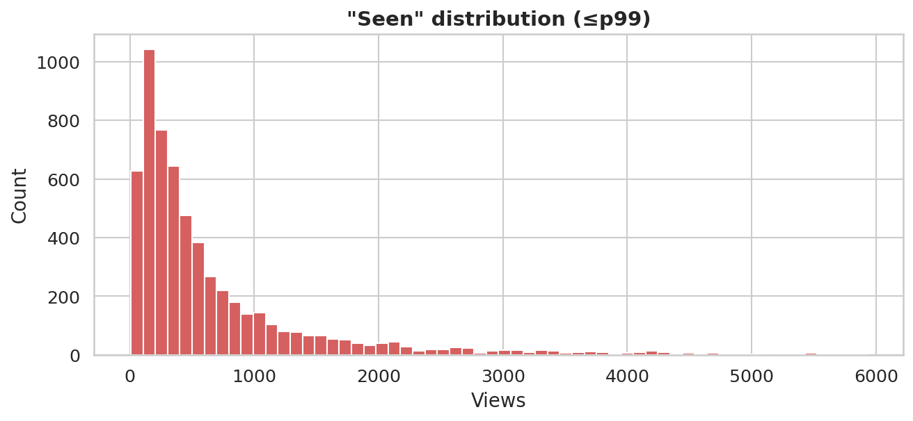

The distribution is strongly **right-skewed**, following a Pareto-like pattern typical of online marketplace engagement: most listings receive 100–300 views, while a small minority reaches 4,000–6,000+. View counts drop rapidly above 500 and become very rare above 2,000. The top ~10% of listings by views likely capture a disproportionate share of total platform traffic. A few "viral" listings reaching 5,000+ views likely represent highly sought-after items or listings that remained active for an extended period.

---

### 13 — Price vs Seen views (scatter plot)

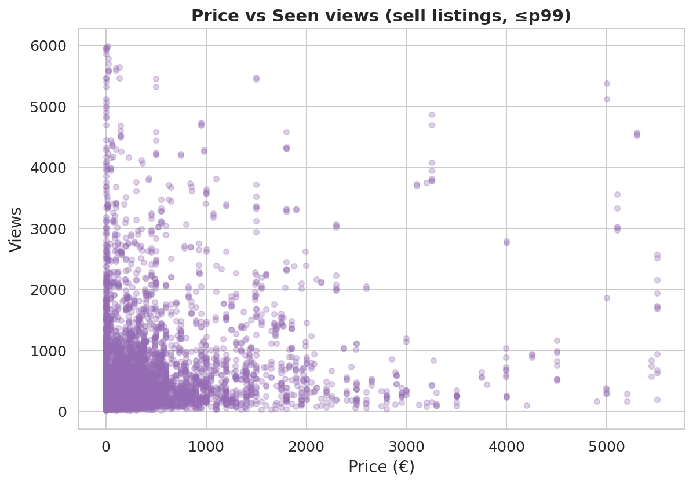

The scatter is dominated by a dense cluster in the **bottom-left** (price 0–500 €, views 0–1,000). As price increases, point density drops sharply. The **vertical band near price = 0** contains several high-view listings — likely "price on request" ads that attract curiosity-driven traffic. There is no strong positive correlation: a high asking price does not generate more views. If anything, expensive listings attract a narrower, more targeted audience. A few high-priced outliers (>€3,000) still achieve 1,000–4,000+ views, indicating that rare or desirable instruments generate significant interest regardless of price.

---

### 14 — Median views — top 15 brands

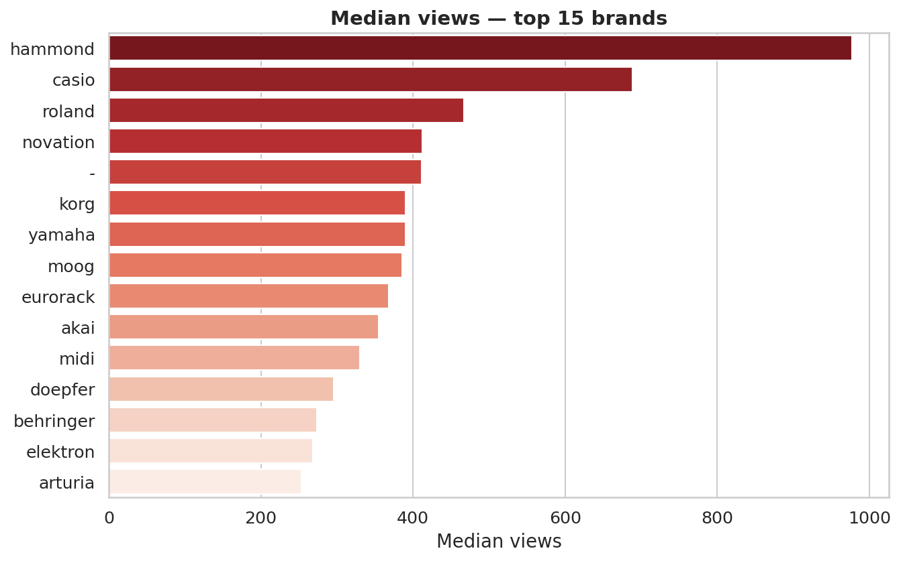

Premium brands generate higher median view counts per listing, consistent with their aspirational appeal and community reputation within the Hispasonic audience. Budget brands and niche modular components (Doepfer, Eurorack) attract fewer views per listing, likely because their audience is more narrowly targeted and browsing behaviour is more purposeful.

---

## Correlations and Cross-Group Analysis

> Numeric correlation structure and combined brand × city × type breakdowns.

### 15 — Correlation matrix — numeric variables

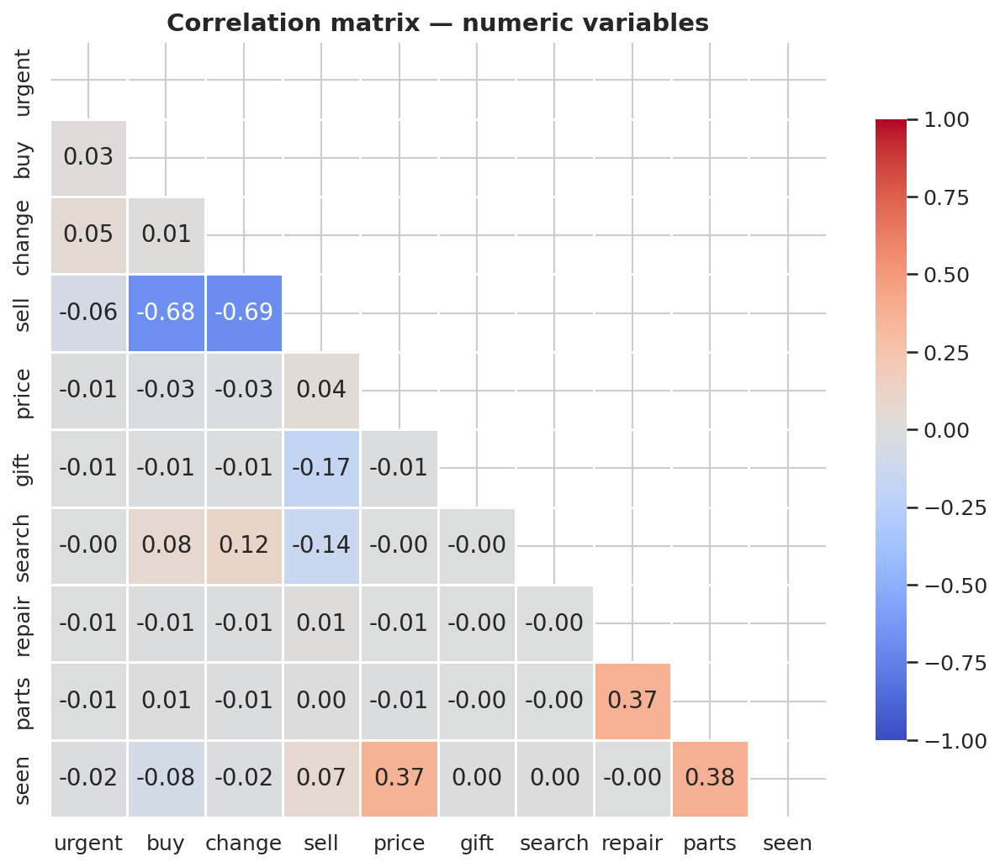

- **`sell` ↔ `buy` = −0.68** and **`sell` ↔ `change` = −0.69**: strongly negative by construction — these are mutually exclusive listing type flags. The high magnitude reflects the encoding scheme, not a market phenomenon.
- **`price` ↔ `seen` = +0.37**: the most analytically meaningful relationship. Higher-priced listings attract somewhat more views, possibly because they represent more desirable or aspirational instruments.
- **`repair` ↔ `parts` = +0.37**: co-occurrence makes intuitive sense — people fixing instruments also look for components.
- **`parts` ↔ `seen` = +0.38**: parts listings attract above-average views, as a single spare part can satisfy multiple potential buyers simultaneously.
- Most other pairs are near zero — **low multicollinearity**, a favourable property for downstream modelling.

---

### 16 — Brand × City — listing count heatmap (top 10 each)

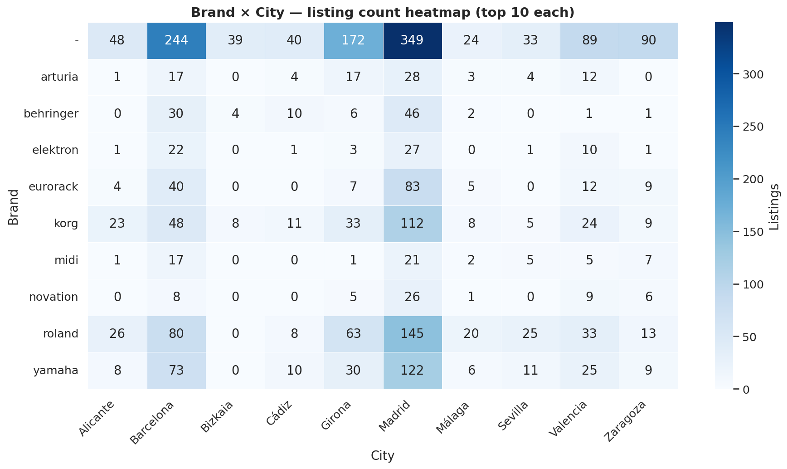

**Madrid** is the darkest column for virtually every brand: Roland (145), Yamaha (122), Korg (112), Eurorack (83). **Barcelona** is consistently second. **Elektron** is notably concentrated in large cities (Madrid 27, Barcelona 22) with minimal presence elsewhere, consistent with its premium boutique positioning and the tendency for high-end gear buyers to cluster in major cities. **Behringer** shows broad but modest national distribution — consistent with its role as an accessible, mass-market brand. Bizkaia, Cádiz and Málaga show near-zero listings for most brands, confirming their peripheral market status in this dataset.

---

### 17 — Median price by brand and listing type (top 10 brands)

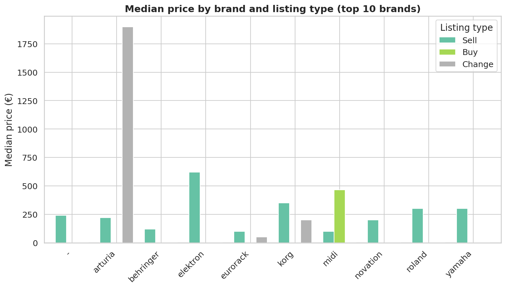

**Behringer "Change"** listings show an anomalous median of ~€1,875 — far above Behringer's typical sell price (~€110). A plausible explanation is **trade-up dynamics**: sellers offer a bundle of Behringer items or equipment in exchange for a single high-end piece, resulting in a high aggregate valuation. **Elektron** leads the sell-type median at ~€620. **Midi "Buy"** at ~€450 suggests buyers searching for MIDI equipment are targeting professional controllers, not cheap interfaces. The absence of Buy and Change bars for several brands reflects very few listings of those types in the top-10 subset.

---

### 18 — Median sell price over time — top 5 brands

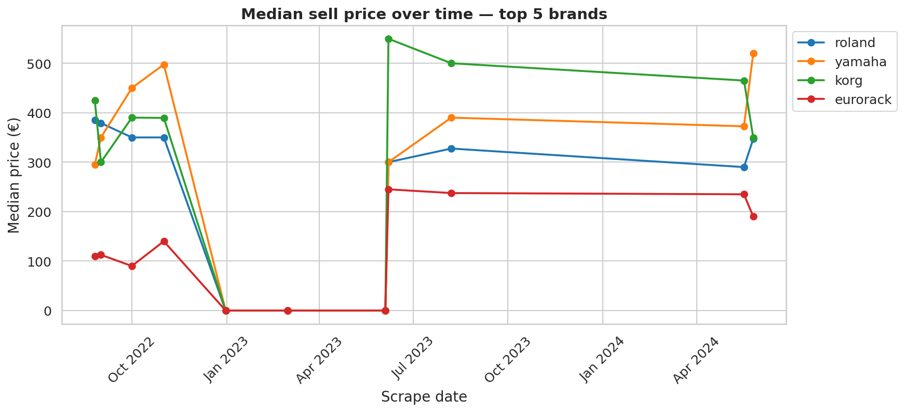

**Korg** (green) commands the highest and most consistent median price throughout (~€300–550), reflecting strong collector and producer demand. **Yamaha** (orange) is the most volatile: peaks at ~€500 in Oct 2022, collapses to near 0 in three problematic sessions (Dec 2022 – Jun 2023), then recovers to €370–520 by 2024. **Roland** (blue) is the most price-stable brand, hovering in a narrow €290–400 range throughout the period — a sign of a liquid, competitive resale market. **Eurorack** (red) sits lowest (~€95–250), consistent with trading individual modules. The **price = 0 collapse visible for all brands** between Dec 2022 and Jun 2023 is a confirmed data quality artefact (missing price fields), not a real market event.

---

## Supply & Demand Analysis

> Generated by [`notebooks/03_supply_demand.ipynb`](../notebooks/03_supply_demand.ipynb)
> **Definitions:** Supply = `sell == 1` · Demand = `buy == 1` or `search == 1` · D/S ratio = demand / supply × 100

### 19 — Supply vs demand by city

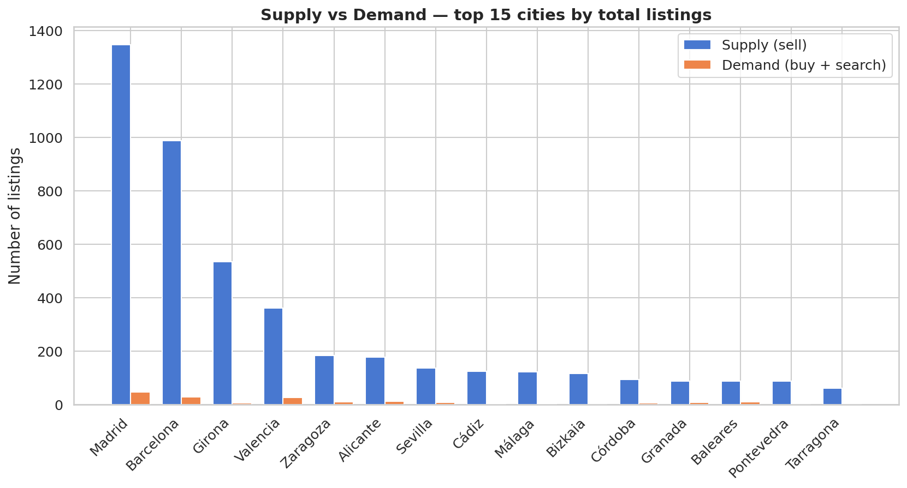

Supply bars dominate in every city. Demand is nearly invisible at this scale — global D/S ratio is 4.42%. The market is structurally oversupplied.

---

### 20 — D/S ratio ranking by city

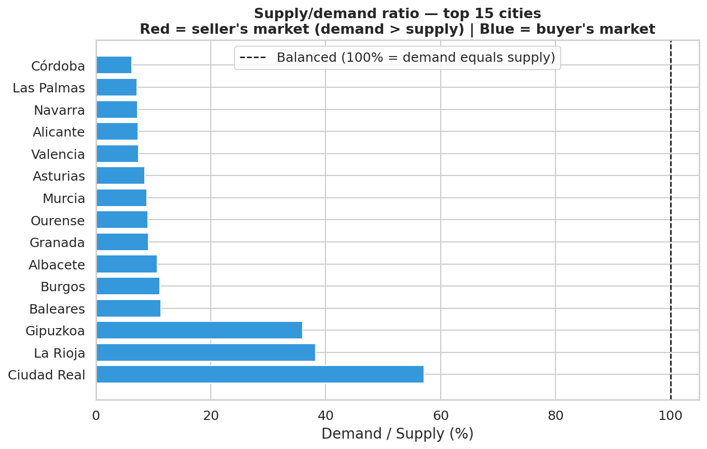

Every city is a buyer's market. No city reaches the 100% balanced line. Ciudad Real tops the ranking at 57% due to a near-zero supply denominator — a statistical artefact, not genuine demand strength.

---

### 21 — D/S ratio vs median price (scatter)

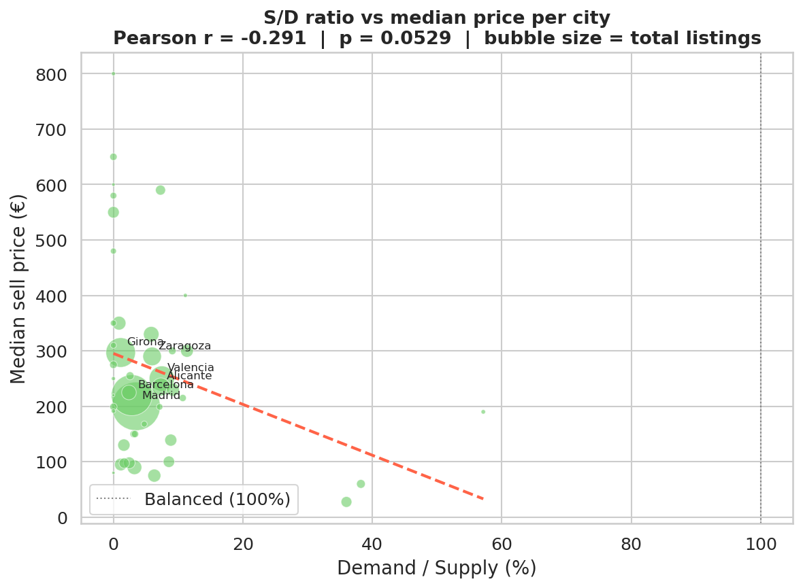

Pearson r = −0.291, p = 0.0529. The central hypothesis is not confirmed: a higher D/S ratio does not lead to higher prices. The direction is even counterintuitive — cities with more relative demand tend to trade cheaper instruments. Price is driven by instrument type, not local supply/demand pressure.

---

### 22 — D/S ratio and median price — dual axis (top 12 cities)

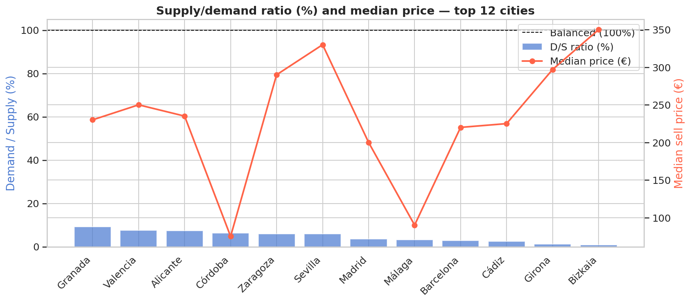

Price and ratio move independently across cities. Bizkaia has one of the lowest D/S ratios yet one of the highest median prices — confirming that instrument mix, not local demand balance, determines price.

---

### 23 — Supply and demand over time by city

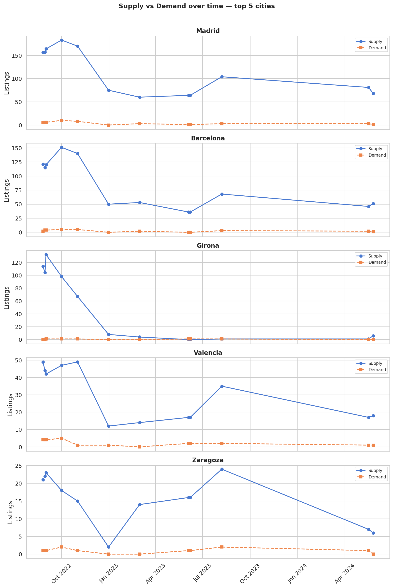

The demand line is flat near zero for all cities throughout 2022–2024. Supply drives all the temporal variation. Girona's supply collapsed entirely after early 2023 and never recovered.

---

### 24 — D/S ratio evolution over time by city

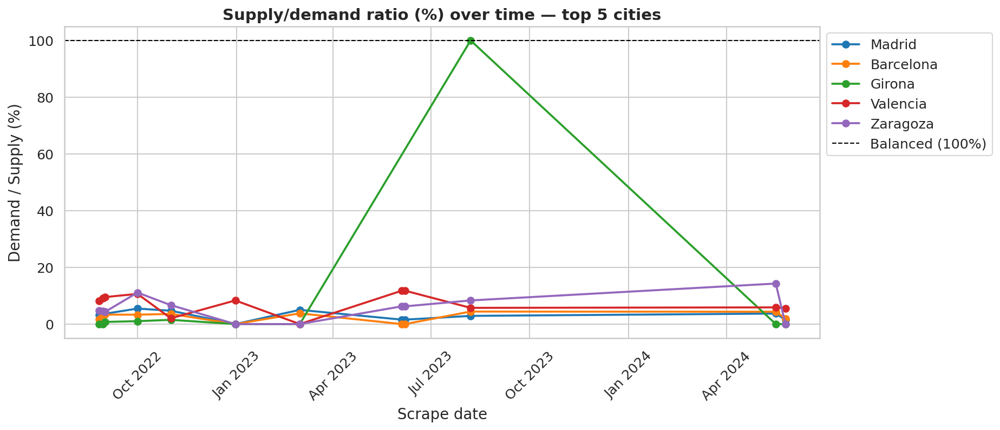

All cities remain within the 0–15% band. Girona shows a spike to 100% in Jul 2023 — a zero-denominator artefact (zero supply + one demand listing), not a real demand event.

---

### 25 — Global market: supply, demand, ratio and price over time

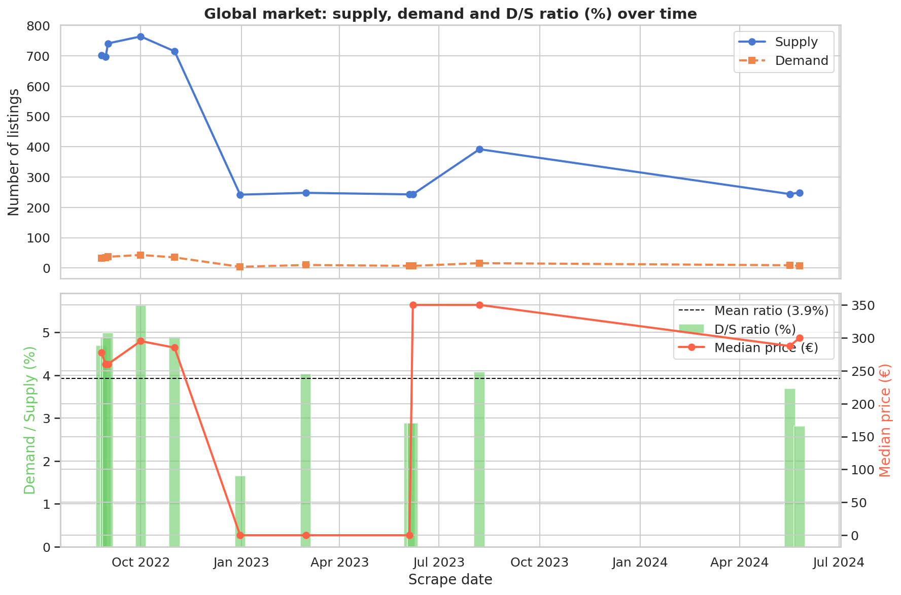

Supply halved in Jan 2023 and never fully recovered. Mean D/S ratio across the full period: 3.9%. Price anomalies in early 2023 are data sparsity artefacts caused by missing price fields in those scrape sessions.

---

### 26 — Mean views (passive demand) vs median price by city

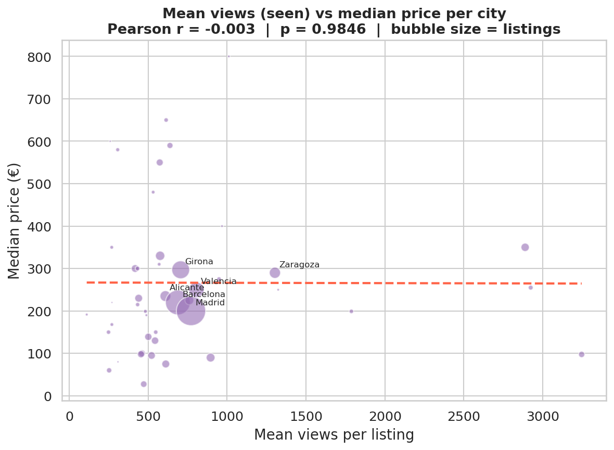

Pearson r = −0.003, p = 0.985. Views have essentially zero predictive power over price at the city aggregation level. Cheap listings attract more views, creating an inverse pull that cancels any positive price signal.

---

### 27 — Lagged correlation: D/S ratio at (t) → price at (t+1)

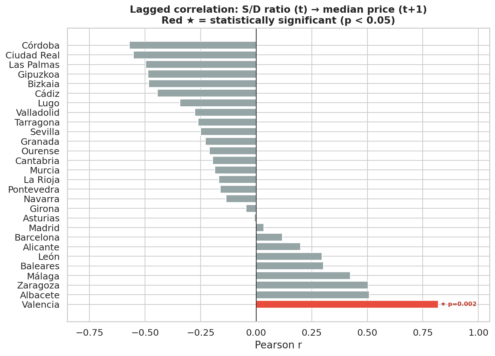

**Valencia** is the only city with a statistically significant lagged correlation (r = 0.819, p = 0.002): its D/S ratio at time *t* predicts median price at time *t+1*. All other 27 cities show no significant result. Valencia is the only market where the classical economic mechanism — demand anticipating price — is empirically active in this dataset.
